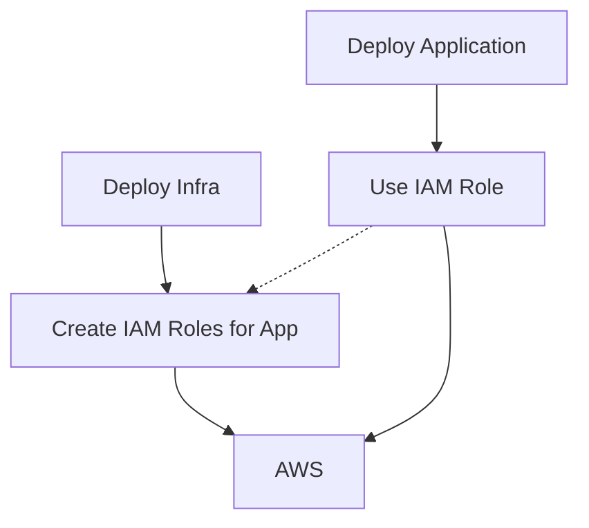

# Security

This document explains how to best organize terraform resources such that we optimize around:

* Creating environments that are resistant to change.
* Allow developers to impact changes in the most secure way keeping them safe from accidental changes.
* Limit the blast radius of a security compromise or developer mistake by providing a "least permission" model around the automation system.

## Organization

In general, I tend to organize my terraform in the following structure:

=== "Layout"

    * repo_name:
        * terraform/
           * provider/ 
              * region or zone/
                * env_name/
                    * infra/
                    * bootstrap/
                    * application/

=== "Example"

    * my_awesome_project.git:
        * terraform/
            * aws
                * us-east-1
                    * dev
                        * infra
                        * bootstrap
                        * application
                      * stage
                          * infra
                          * bootstrap
                          * application
                      * production
                          * infra
                          * bootstrap
                          * application
                    * ap-northeast-1
                      * dev
                          * infra
                          * bootstrap
                          * application
                      * stage
                          * infra
                          * bootstrap
                          * application
                      * production
                          * infra
                          * bootstrap
                          * application
                  * observability
                    * wavefront
                        * infra
                        * dev
                        * stage
                        * production
                    * pager-duty
                    
# Blast radius

This layout allows us to ensure a few critical things in our infrasutructure design:

- Administrators own both the `infra` and `bootstrap` directories. 
    - Things in `bootstrap` are only used once.
    - Things in infra change infrequently and are run by hand ( not CI/CD ).
- Application developers can PR infrastructure changes via changes to the anything in the `application` directory
- The CI/CD workflows are configured to run off of any changes in `application`.
- The most important aspect of this is that we're *NOT* requiring an admin user for CI/CD 
 
Using an admin user to automatically run `infra` or `application` ( or both ) would expose our automation 
to a high-level, potentially large surface area of compromise if the admin user was every actually 
compromised for whatever reason.

Instead, I usually aim at exposing the automation to `least perm` or "Least possible permissions" in order
to help lower the overall surface area of potential exposure in the automation system.

### Example

In this example we'll use a very simple AWS roll out.  In this case the `bootstrap` would be setup for us already.
Which means the s3 bucket for state and DynamoDB table for state locking are already setup.

I would start by running `terraform apply` in the `infra` repo, which will setup an IAM user with a trust relationship
for our github org/repo/env.  This IAM role has the absolute minimum IAM permissions for the next part, which is the
`application` deployment.

Next, we would expect our Github ( or whatever ) workflow to kick off and execute several steps:

* Start by executing the OIDC workflow to assume the IAM role setup by the `infra` terraform.
* Once the role is assumed, we can now execute `terraform plan/apply`

#### Diagram

